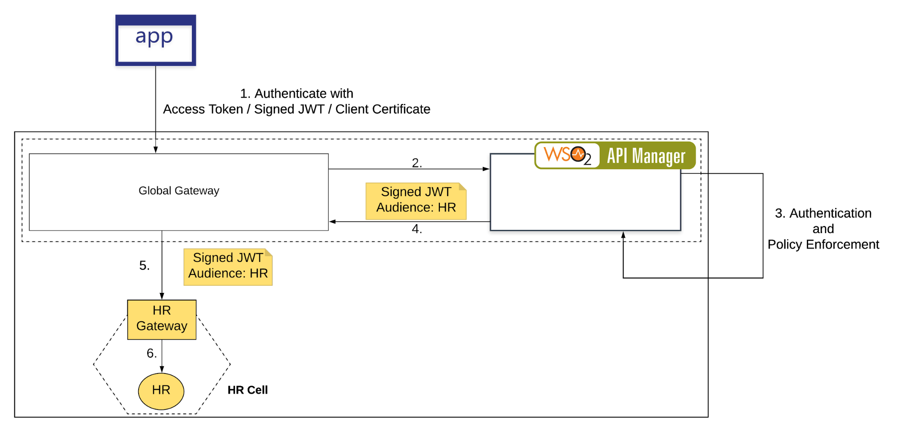
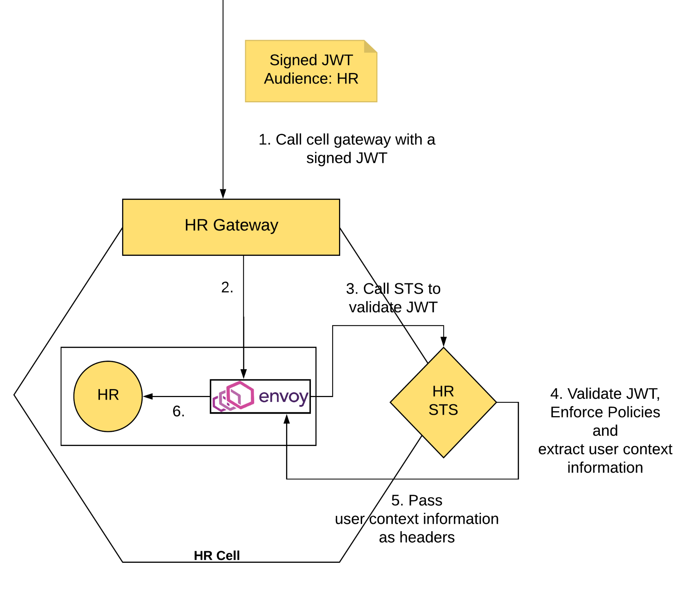
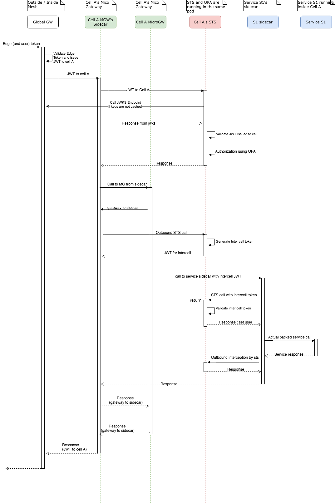
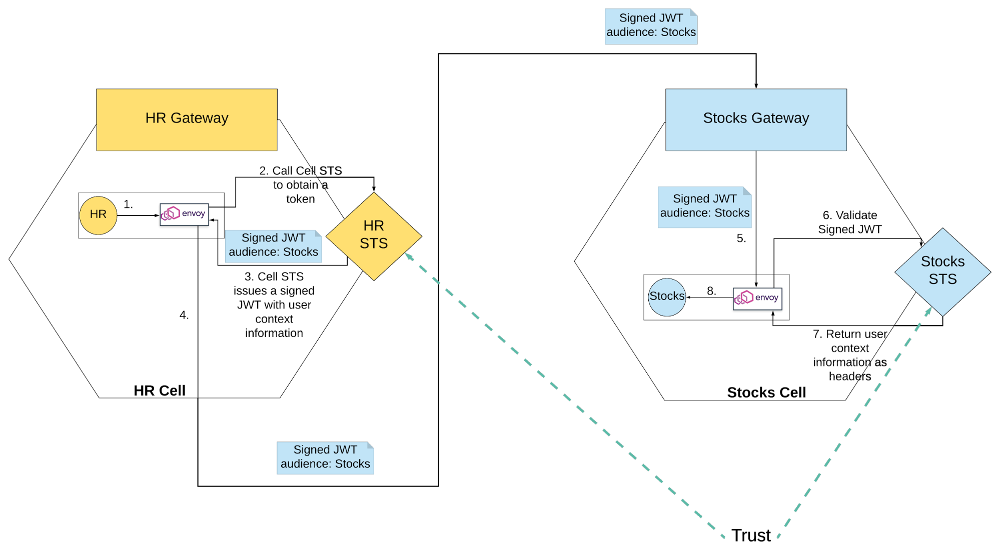

## 1.Mesh Security

Within Cellery, each cell is considered as a unique trust domain. Each of these cells have it's own Secure Token Service (STS) which the workloads can use to communicate in a trusted manner with each other. Not only authentication, but also fine grained authorization requirements are also  can be achieved for inter and intra cell communications. 

### 1.1 Journey of a request in terms of security.

#### Edge Security 

Cellery mesh has an entry point to the data plain which we call as the global gateway. Cell developers publish their global APIs to global gateway which ultimately are be exposed through global gateway. These APIs can be protected or unprotected. In a case if the APIs are protected, the end user will be retrieving an edge token to invoke the API through global gateway.

This token will be an opaque token and end users uses this token to invoke APIs. Upon invoking APIs, global gateway issues a JWT token to the backend service, which is exposed through the cell gateway after validating the edge token. 




#### Cell Security

From this point onwards the request will be flowing through cells and this is the first entry towards a cell. Each data plane component in Cellery has a sidecar attached to it. The requests which reaches components are intercepted by the STS through sidecars.



### Token Request Flow

Below sequence diagram elaborates the flow of a request within Cellery mesh while interacting with two cells



### Inter Cell Communication



Cells have trust relationship with each other. When a service in one cell invokes a service in another cell, issuer a cell’s STS issues a token addressing the destination cell passing user context obtained through the original edge token. Destination cell validates the token using issuer cells keys. In a case key is not cached, it will call the JWKS of the issuer cell and retrieve keys.  


```2018-04-09 11:33:21,300 ERROR [foo] - This is an error log.```

### Log Outputs 

In Ballerina, all the logs are written to the `stderr` stream by default. Therefore, the logs are printed in the console. This makes it easy to debug the code in a container environment.

Log outputs can be printed to a log file using a CLI argument or using configurations.

Different output logging levels can be defined for packages. For more information, see the **Log Level** section.

### Log Level

This package provides functions to log at the `DEBUG`, `ERROR`, `INFO`, `TRACE`, `WARN`, `OFF`, and `ALL` levels. By default, all log messages are logged to the console at the `INFO` level. The `OFF` log level turns off logging and the `ALL` log level allows all log levels.

## Sample  

Follow the steps given below to run the sample and get sample log outputs.

1. Create a directory named `foo`, add the code given below to a  file, and name the file `test.bal`.


```json
	package foo;
	import ballerina/log;

	function main(string[] args) {
    	  error err = {message: "error occurred"};
    	  log:printDebug("debug log");
    	  log:printError("error log");
    	  log:printErrorCause("error log with cause", err);
    	  log:printInfo("info log");
    	  log:printTrace("trace log");
    	  log:printWarn("warn log");		
	}
```

2. Navigate to the directory where the `test.bal` file is saved via the terminal and run the file using the command given below.

      `ballerina run foo/`

3. By default, the logs are printed to the console. To write logs to the `test.log` file, execute the following command.

     `ballerina run foo/ 2> test.log`


4. Controlling the log level of the `foo` package:

* The log level for the `foo` package can be changed to ERROR as follows using CLI arguments.

     `ballerina run foo/ -e foo.loglevel=ERRORR`


* To set the log level of `foo` pacakge using a configuration file, create a file named `ballerina.conf` in the source root of `test.bal`, and place the following entry..

     ```ballerina
      [foo]
      loglevel="ERROR"
     ```
   Next, run the `test.bal` file to print the ERROR logs.
    `ballerina run foo/`


